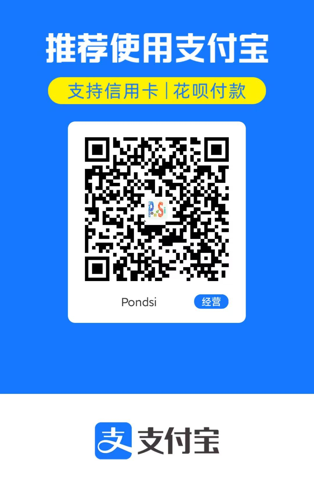

# Sponsors

## English

If you find `UnreadBadgeOpenClaw` helpful, consider supporting its development. Your support helps maintain and improve this project. Thank you!

- **PayPal**: https://paypal.me/pondsi
- **WeChat Pay**: 
- **Alipay**: 

## 简体中文

如果 `UnreadBadgeOpenClaw` 对你有帮助，欢迎支持它的持续开发。你的支持会让这个项目维护得更好。谢谢！

- **PayPal**：https://paypal.me/pondsi
- **微信支付**：
- **支付宝**：

## 繁體中文

如果 `UnreadBadgeOpenClaw` 對你有幫助，歡迎支持它的持續開發。你的支持會讓這個專案維護得更好。謝謝！

- **PayPal**：https://paypal.me/pondsi
- **微信支付**：
- **支付寶**：

## 한국어

`UnreadBadgeOpenClaw`가 도움이 되셨다면 개발을 후원해 주시기 바랍니다. 여러분의 후원은 이 프로젝트를 더 잘 유지보수하는 데 힘이 됩니다. 감사합니다!

- **PayPal**: https://paypal.me/pondsi
- **위챗페이**: 
- **알리페이**: 

## Русский

Если `UnreadBadgeOpenClaw` оказался полезным, вы можете поддержать его разработку. Ваша поддержка помогает поддерживать и улучшать проект. Спасибо!

- **PayPal**: https://paypal.me/pondsi
- **WeChat Pay**: 
- **Alipay**: 

## 日本語

`UnreadBadgeOpenClaw` がお役に立てば、開発のご支援をいただけると幸いです。皆さまのご支援がこのプロジェクトの維持と改善につながります。ありがとうございます！

- **PayPal**: https://paypal.me/pondsi
- **WeChat Pay**: 
- **Alipay**: 

## Español

Si `UnreadBadgeOpenClaw` te resulta útil, considera apoyar su desarrollo. Tu apoyo ayuda a mantener y mejorar este proyecto. ¡Gracias!

- **PayPal**: https://paypal.me/pondsi
- **WeChat Pay**: 
- **Alipay**: 

## Français

Si `UnreadBadgeOpenClaw` vous est utile, vous pouvez soutenir son développement. Votre soutien aide à maintenir et à améliorer ce projet. Merci !

- **PayPal** : https://paypal.me/pondsi
- **WeChat Pay** : 
- **Alipay** : 

---

## Other Ways to Support / 其他支持方式

- ⭐ Star this repo — it helps others discover `UnreadBadgeOpenClaw`
- 🐛 Report issues or suggest features
- 🔧 Submit patches or improvements
- 📣 Share with friends and colleagues

Thank you for your support! — Pondsi

Pondsi (+MiMo-v2.5/v2.5pro+deepseek-v4-flash/pro+deepseek-v4.1-flash-expires-on-0910+GLM5.3-flash+Gemini3.1-pro+Qwen3.8-27b+Gemini3.8-flash) — automatically committed by OpenClaw
