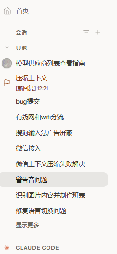
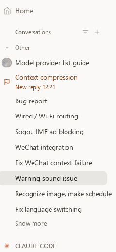

# 说明.md — UnreadBadgeOpenClaw 详细说明

> 本文件是面向中文用户的完整说明书。安装速览见 README.md，机器可执行步骤见 SKILL.md。

## 一、这个项目做什么

OpenClaw 的 Control UI 侧边栏会列出所有会话。当某个会话在主人离开时完成了回复（或失败了），
默认只能靠提示音知道——一旦没听到，就不知道该去看哪个会话。

本技能给会话行打一个**持久的未读徽章**：

| 事件 | 图标 | 文字标记 |
|------|------|----------|
| 回复完成 | 🚩 flag（绿色旗） | `[New reply] HH:mm` |
| 回复失败 | ⚠️ alert（警告） | `[Failed] HH:mm` |

- **图标走 attention 通道，永远可见**——就算侧边栏关闭了「显示消息预览」也一样
  （这是从 Control UI 渲染源码里挖出来的关键结论：纯文字 note 在预览关闭时根本不渲染）。

| 实际效果（中文界面） | 实际效果（英文界面） |
|---|---|
|  |  |
- 打开会话、给会话发新消息、TTL 到期时，网关**原生清除**徽章——徽章的含义是「未读」，
  不会变成一堆过期垃圾。
- 每条徽章最多保留 120 分钟（网关上限），配套 keepalive 脚本每 90 分钟续期，
  最长 7 天兜底强制清除。

## 二、安装

1. 前提：本机已安装 OpenClaw（需要 `openclaw` CLI 或 `openclaw.mjs` 入口文件）。
2. 从 ClawHub 一键安装：`clawhub install unreadbadgeopenclaw`；
   或从 GitHub 克隆后把 `scripts/` 目录复制到任意位置。
3. 如果 `openclaw.mjs` 不在常见 npm 全局目录，设置环境变量 `OPENCLAW_MJS` 指向它。
4. 状态文件写在 `$OPENCLAW_STATE_DIR/unread-marks.json`（默认 `~/.openclaw`），
   可用 `OPENCLAW_STATE_DIR` 环境变量改位置。

## 三、使用

```bash
# 回复完成 → flag 图标 + [New reply] HH:mm
node scripts/unread-mark.js --key <会话key> --event done

# 回复失败 → alert 图标 + [Failed] HH:mm
node scripts/unread-mark.js --key <会话key> --event warn

# 续期（建议每 90 分钟一次；用 OpenClaw automation / cron / 计划任务调度）
node scripts/unread-mark-keepalive.js

# 演练模式（不实际打标，看它打算做什么）
node scripts/unread-mark-keepalive.js --dry-run
```

参数全集见 SKILL.md 的 English 节。两个脚本**任何异常都静默 exit 0**——
通知辅助程序绝不能反过来打断它所报告的主流程。

### 接入到回复完成钩子

在自己项目的 Node 钩子里：

```js
const { execFileSync } = require("child_process");
execFileSync(process.execPath,
  ["<skill目录>/scripts/unread-mark.js", "--key", sessionKey, "--event", "done"],
  { timeout: 30000 });
```

PowerShell 里直接 `node 脚本路径 --key ... --event ...`。
**千万不要**用 `Start-Process` 传含空格的参数——PowerShell 5.1 会按空格拆参数、
吃掉内层引号，时间戳会被截断。

## 四、工作原理（简述）

1. `unread-mark.js` 通过本地网关 RPC `sessions.patch` 一次性写入整个
   `agentStatus` 对象（`{statusNote, attention, ttlMinutes}`）——单 patch 覆盖，
   换图标时旧图标不可能残留。
2. 徽章存进本地状态文件，`unread-mark-keepalive.js` 周期性对照
   `sessions.list`：会话没了 / **网关标记已被清除（已读或到期）** / 已读（`lastReadAt > 创建时间`）
   → 删除记录、不再续；只有「标记仍在网关且未读」才重打一次 120 分钟 TTL。
   **已被清除的标记绝不复活**——网关才是标记的持有者，标记不在就是不在。
   （v1.1.1 修复：旧版先看读取时间，当读取时刻与打标时刻几乎相同
   `lastReadAt <= created` 时会误判「未读」，把主人已经读过并清除的标记续回来，
   表现就是「标记消失约 90 分钟后又自己出现」。）
3. 7 天是硬兜底：无条件清除并删记录，防止"永远未读"。

深度分析（渲染链优先级、清除点全列表、验证手册）见 `references/internals.md`。

## 五、文件操作范围

- **写**：`$OPENCLAW_STATE_DIR/unread-marks.json`（自己的状态文件，仅此一个）。
- **网络**：只调用本机 OpenClaw 网关 RPC（`sessions.patch` / `sessions.list`），
  不访问任何外部服务器。
- **不碰**：会话内容、聊天记录、任何其他配置文件。

## 六、限制与风险

- 依赖 OpenClaw 网关在本地运行；网关不在线时打标失败（静默，exit 0）。
- `ttlMinutes` 被网关钳制在 1–120 分钟；更长的值静默变 120。
- 当前聚焦中的会话会被 UI 的「可见即已读」机制在毫秒级清掉标记——这是网关设计行为，
  测试请用非聚焦会话。
- 图标词表固定为 6 个：`alert, flag, hand, key, lock, hourglass`，传别的会被网关拒绝
  （但脚本仍 exit 0，需要看响应体里的 `"ok":false`）。

## 七、常见问题

**Q：为什么我打的标记立刻消失了？**
A：你正看着那个会话。聚焦会话 = 已读，网关立刻清徽章。换个会话再测。

**Q：为什么只有图标没有文字（或反过来）？**
A：关闭「显示消息预览」后文字不渲染，只有图标通道常显。两者都设置，互补。

**Q：CLI 明明失败为什么退出码是 0？**
A：设计如此（静默失败）。要调试请直接跑命令看 stdout 的 `[unread-mark]` 行。

---

Pondsi (+MiMo-v2.5/v2.5pro+deepseek-v4-flash/pro+deepseek-v4.1-flash-expires-on-0910+GLM5.3-flash+Gemini3.1-pro+Qwen3.8-27b+Gemini3.8-flash) — automatically committed by OpenClaw
